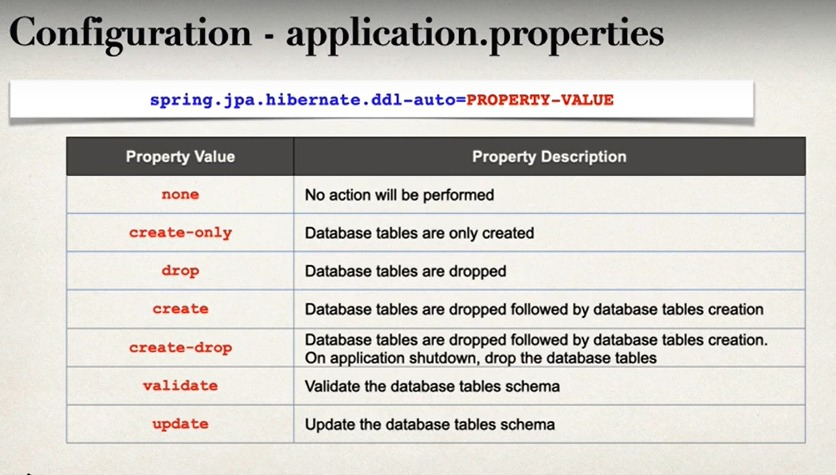

# Created while learning HibernateJPA, notes about the stuff I learned for revision
---

# hibernateJPA

# Command Line Runner
  - Command-line runners are a useful functionality to execute the various types of code that only have to be run once, right after application startup.

# Hibernate
- A framework persisting/saving Java objects in DB
- it handles all the low-level SQL code
- Minimizes amount of JDBC code you have to develop
- Hibernate provided ORM(Object to Relational Mapping)
## ORM
- developer define mapping between java class and database table
- JavaClass <-------> Hibernate <---------> Database Table

# JPA (Jakarta Persistence API)
- Standard API for OPM
- Only a specification
    - Defines a set of interfaces
    - Requires an implementation to be usable
- Hibernate is the most popular implementation of JPA
## Benefits of JPA
- By having standard API you are not locked to vendor's implementation
- Maintain portable, flexible code by coding to JPA spec(interfaces)
- Can switch between two vendor implementations

## DB Calls
- `entityManager` is a special JPA object or JPA helper object
- used to store the data into database
- `persist` is used to insert
- `find` to retrieve data based on a key
- Hibernate JPA uses JDBC for DB communications

# DB Connection
- `spring.datasource.url` specify the host
- `spring.datasource.username` specify the username
- `spring.datasource.password` specify the password
- spring will automatically connect to jdbc if specified in url

# Entity Class
- Java class that is mapped to database table
- Entity class should be annotated with `@Entity`
- Must have public or protected no-argument constructor
  - Class can have other constructor
- `@Column` is used to specify to which column the data should be added
- `@Id` added for primary key

# Data Access Object (DAO)
- it is common design pattern
- Responsible for interacting with database

# JPA Entity Manager
- JPA Entity Manager is the main component for saving/retrieving entities
- JPA Entity Manager needs a Data Source
- Data Source defines database connection info
- JPA Entity Manager and Data Source are automatically created by Spring Boot
- We can autowire/inject JPA Entity Manager into DAO

# EntityManager vs JpaRepository
- if you need **low-level control and flexibility**, use **EntityManager**
- If you want **high-level of abstraction**, use **JpaRepository**

# `@Transactional`
- Spring provides an `@Transactional` annotation
- Automatically begin and end a transaction for your JPA code no need to explicitly do this

# `@Repository`
- `@Repository` sub annotation of `@Component`
- Applied to DAO implementations
- Spring will automatically register the DAO implementation
  - It uses component-scanning
- Spring also provides translation of ant JDBC related exceptions

# JPA Query Language (JPQL)
- Query Language for retrieving objects
- Similar to concept to SQL
  - where, like, order, join etc
- JPQL is based on **entity names** and **entity fields** not on table names
- `entityManager.createQuery("SELECT * FROM Student").executeUpdate()` we can use this here we give the whole sql query

# Create table based on Java Code
- `spring.jpa.hibernate.ddl-auto=PROPERTY_VALUE`
- 
- 
